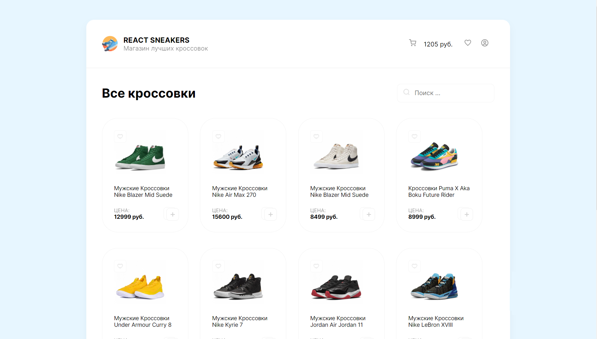
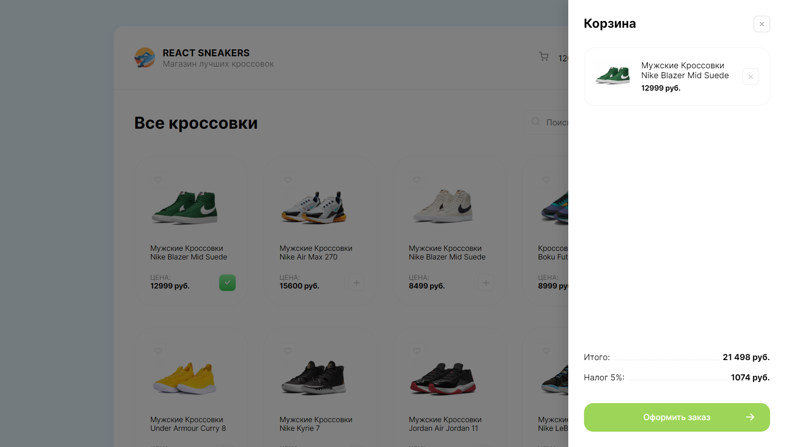

# A small project where I tried to make a sneaker shop.

## As a frontend, I used React + scss. As a backend I use a web service called mockapi. This is where I store all my data. The project is still in development

